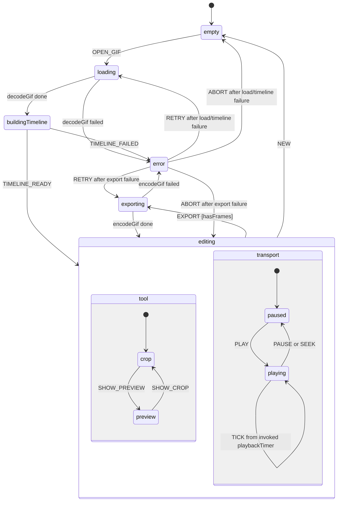

# Framecut XState Machine

This document describes the explicit XState machine in `src/machine/editorMachine.js`.
`src/main.js` is now only the composition root for the actor, encoder, template,
event bindings, and renderer.

## State Hierarchy

```text
editor
|
+-- empty
|
+-- loading
|
+-- buildingTimeline
|
+-- editing (parallel)
|   |
|   +-- tool
|   |   +-- crop
|   |   `-- preview
|   |
|   `-- transport
|       +-- paused
|       `-- playing
|
+-- exporting
|
`-- error
```

## Diagram



## Primary Flow

```text
empty
  -> OPEN_GIF
loading
  -> decodeGif success
buildingTimeline
  -> TIMELINE_READY
editing.tool.crop + editing.transport.paused
  -> edit crop/output/flip/limit/zoom
  -> preview/play/seek as needed
  -> EXPORT
exporting
  -> encodeGif success
editing
  -> browser download side effect
```

Failure flow:

```text
loading/buildingTimeline/exporting
  -> error
  -> Retry re-enters the failed async state
  -> Abort returns to empty or editing based on error.returnState
```

## State Inventory

| State                       | Purpose                                                     | Visible UI                                                   | Exit                                                                               |
| --------------------------- | ----------------------------------------------------------- | ------------------------------------------------------------ | ---------------------------------------------------------------------------------- |
| `empty`                     | No GIF is loaded.                                           | Drop zone, disabled export button.                           | `OPEN_GIF` starts loading.                                                         |
| `loading`                   | Invokes `decodeGif`.                                        | Blocking progress panel.                                     | Success enters `buildingTimeline`; failure enters `error`.                         |
| `buildingTimeline`          | Renderer builds frame thumbnails from decoded frames.       | Editor shell plus blocking progress panel.                   | `TIMELINE_READY` enters `editing`; `TIMELINE_FAILED` enters `error`.               |
| `editing.tool.crop`         | Shows the source frame and crop overlay.                    | Crop handles and source-sized canvas.                        | `SHOW_PREVIEW` switches tool state.                                                |
| `editing.tool.preview`      | Shows transformed output.                                   | Cropped, resized, flipped preview canvas.                    | `SHOW_CROP` switches tool state.                                                   |
| `editing.transport.paused`  | Stable editing and seeking state.                           | Play control.                                                | `PLAY` enters playing.                                                             |
| `editing.transport.playing` | Advances frames using GIF delays through an invoked machine timer. | Pause control and animated canvas.                           | `PAUSE` or `SEEK` returns to paused; `TICK` re-enters playing and schedules the next frame. |
| `exporting`                 | Invokes `encodeGif` with the optimization strategy.         | Blocking progress panel and disabled export.                 | Success returns to `editing`; failure enters `error`.                              |
| `error`                     | Holds normalized error details and waits for user recovery. | Blocking error dialog with Abort and, when supported, Retry. | `RETRY` re-enters the failed async state; `ABORT` returns to `empty` or `editing`. |

## Events

| Event                             | Source                       | Effect                                                             |
| --------------------------------- | ---------------------------- | ------------------------------------------------------------------ |
| `OPEN_GIF`                        | File input or drop zone      | Stores `pendingFile`, clears previous error, enters `loading`.     |
| `TIMELINE_READY`                  | Renderer timeline builder    | Enters `editing`.                                                  |
| `TIMELINE_FAILED`                 | Renderer timeline builder    | Normalizes the failure as a load error and enters `error`.         |
| `UPDATE_CROP`                     | Inputs or crop gesture       | Constrains crop to source bounds.                                  |
| `RESET_CROP`                      | Reset button                 | Restores the initial source crop.                                  |
| `SET_OUTPUT_EDGE`                 | Output input                 | Clamps the maximum output edge to strategy limits.                 |
| `TOGGLE_FLIP_X` / `TOGGLE_FLIP_Y` | Flip controls                | Toggles output transform flags.                                    |
| `SET_LIMIT`                       | Size range or number input   | Clamps and stores `maxBytes`.                                      |
| `SET_FRAME_START` / `SET_FRAME_END` | Frame controls              | Clamps the exported frame range to loaded frames.                  |
| `SET_SPEED`                       | Speed slider                 | Stores a 0.25x to 4x playback/export speed multiplier.             |
| `SET_PALETTE_MODE`                | Palette select               | Stores `full`, `balanced`, or `compact` encoder palette mode.      |
| `SET_ZOOM`                        | Zoom controls                | Clamps preview zoom from 50 to 150 percent.                        |
| `SEEK`                            | Timeline or transport        | Clamps frame index; while playing, also returns to paused.         |
| `PLAY` / `PAUSE` / `TICK`         | Transport and invoked playback timer | Controls playback sub-state and frame advancement.                 |
| `EXPORT_SPRITE_SHEET`             | Sprite sheet button          | Allowed only while editing; renderer opens rows/columns setup and preview before PNG download. |
| `EXPORT`                          | Export button                | Enters `exporting` when frames exist.                              |
| `NEW`                             | New button                   | Clears document context and returns to `empty`.                    |
| `RETRY`                           | Error dialog                 | Retries `loading` or `exporting` based on `error.returnState`.     |
| `ABORT`                           | Error dialog                 | Returns to `empty` for load errors or `editing` for export errors. |

## Context

| Domain                 | Fields                                                        |
| ---------------------- | ------------------------------------------------------------- |
| File and decode        | `pendingFile`, `file`, `parsed`, `frames`, `source`           |
| Transform              | `crop`, `outputEdge`, `flipX`, `flipY`, `zoom`                |
| Optimization           | `maxBytes`, `exportResult`                                    |
| Export controls        | `frameRange`, `speed`, `paletteMode`                          |
| Timeline and transport | `currentFrame`                                                |
| Recovery               | `error` with `code`, `message`, `recovery`, and `returnState` |

## UI Boundary

- `src/ui/template.js` owns static DOM markup, element lookup, and icon refresh.
- `src/ui/events.js` owns DOM event binding and translates user actions into machine events. It checks `snapshot.can(event)` before dispatching user events so invalid actions do not leak into states such as `loading` or `exporting`.
- `src/ui/render.js` subscribes to snapshots and performs DOM/canvas side effects.
- `src/main.js` creates the template, actor, encoder, renderer, and event bindings.

The renderer also owns non-machine browser side effects:

- current-frame canvas drawing
- timeline thumbnail generation
- export download link creation
- sprite-sheet rows/columns setup, preview PNG creation, and confirmed download
- progress/toast/error-dialog presentation

Playback timing is machine-owned. The `editing.transport.playing` state invokes
`playbackTimer`, which sends `TICK` after the current frame delay. The `TICK`
transition re-enters `playing`, advances `currentFrame`, and starts the next
timer from the new frame's delay.

Renderer-to-machine failures use a standardized event protocol. Timeline build
failures are sent as `TIMELINE_FAILED` with a normalized full error object. The
machine records that object in `context.error`, including `code`, `message`,
`recovery`, `cause`, and `returnState`.

## Debug Snapshots

`src/machine/editorMachine.js` exports:

- `serializeEditorContext(context)`
- `serializeEditorSnapshot(snapshot)`

The browser entry point exposes:

```js
window.FramecutDebug.snapshot()
```

This returns a GitHub-issue-friendly snapshot with large frame patch data
summarized as metadata rather than embedded as raw pixel arrays.

## Test Coverage

- `src/machine/editorMachine.test.js` covers the XState transitions, including
  loading, editing sub-states, export success, explicit error recovery, export
  retry, abort-to-editing behavior, machine-owned playback timing, and snapshot
  serialization.
- `src/domain/domain.test.js` covers calculation-only domain logic.
- `src/services/canvas.browser.test.js` runs in Chromium through Vitest browser
  mode and covers browser canvas integration for frame composition, transforms,
  transparency-key mutation, and sprite-sheet PNG export.

Commands:

```bash
npm test
npm run test:browser
npm run build
```
